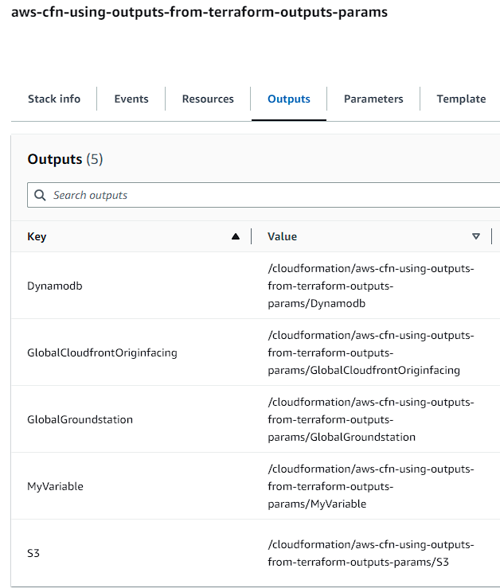
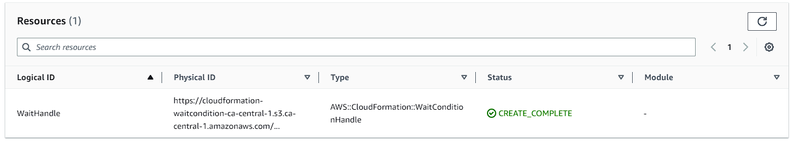

# Using empty CloudFormation Stacks to publish outputs for CloudFormation

This is a companion repository for the written article 'Using empty CloudFormation Stacks to publish outputs for CloudFormation', which demonstrates examples of CloudFormation Templates which pass outputs from Terraform and into CloudFormation. These CloudFormation Templates are handwritten, but in practice would rely on frameworks such as AWS Cloud Development Kit (CDK) to construct the templates.

## Notes

### Why use parameter store over CloudFormation outputs?

CloudFormation outputs allows for a [strict dependency relationship](https://docs.aws.amazon.com/AWSCloudFormation/latest/UserGuide/outputs-section-structure.html) between stacks, but they come with numerous restrictions on them to ensure consistency across the infrastructure as code within AWS. Two constraints are especially notable are:

- You can't delete a stack if another stack references one of its outputs.
- You can't modify or remove an output value that is referenced by another stack.

Due to this, it means that should the value of a CloudFormation exported output change within Terraform, it wil cause a failure to deploy within Terraform as the value cannot change. In comparison, using a parameter store entry does not incur this constraint, allowing it to be freely updated. When an export from Terraform is no longer valid and is being removed, this constraint will also prevent it from being removed should it not be fully removed from all CloudFormation stacks.

### Why use a `WaitConditionHandle`

A `WaitConditionHandle` was chosen over a common resource type like [AWS::IAM::Role](https://docs.aws.amazon.com/AWSCloudFormation/latest/UserGuide/aws-resource-iam-role.html) because the CloudFormation Template is solely focused on the internals of Cloudformation. Using a `WaitConditionHandle` does introduce complexity because it doesn't support an `update` action, which is why the repository generates a random logical ID suffix for this `WaitConditionHandle` to force updates. Using a resource like [AWS::IAM::Role](https://docs.aws.amazon.com/AWSCloudFormation/latest/UserGuide/aws-resource-iam-role.html) has the potential to avoid that, but ultiamtely means introducing another Amazon Web Service (AWS) service like IAM into the mix.

### Why randomize the `WaitConditionHandle` logical ID

The logical ID for this needs to be randomized to ensure that each deployment of the CloudFormation stack will cause an update operation. Otherwise CloudFormation will not trigger updates on non-resource changes. That means that if just the `Parameters` and `Outputs` are changing, CloudFormation will not trigger an update.

You can learn a bit on this from [Amazon CloudFormation stack updates](https://docs.amazonaws.cn/en_us/AWSCloudFormation/latest/UserGuide/using-cfn-updating-stacks.html) or [How does Amazon CloudFormation work?](https://docs.amazonaws.cn/en_us/AWSCloudFormation/latest/UserGuide/cfn-whatis-howdoesitwork.html).

### Why handcraft the templates

The templates in this repository are handcrafted instead of being generated by something like [AWS CDK](https://aws.amazon.com/cdk/) (or cloudformation spec libraries like [cloudtools/troposphere](https://github.com/cloudtools/troposphere)), as this was intended to focus more on the underlying capabilities of CloudFormation, rather than the interface you might work with for ultimately generating the CloudFormation templates.

As an example, when constructing these name helpers within AWS CDK, you might want to support a utility for generating unique names, or encode it baseline into prebuilt patterns. This kind of design decision wasn't the focus on this repository/article, so the templates became handcrafted.
